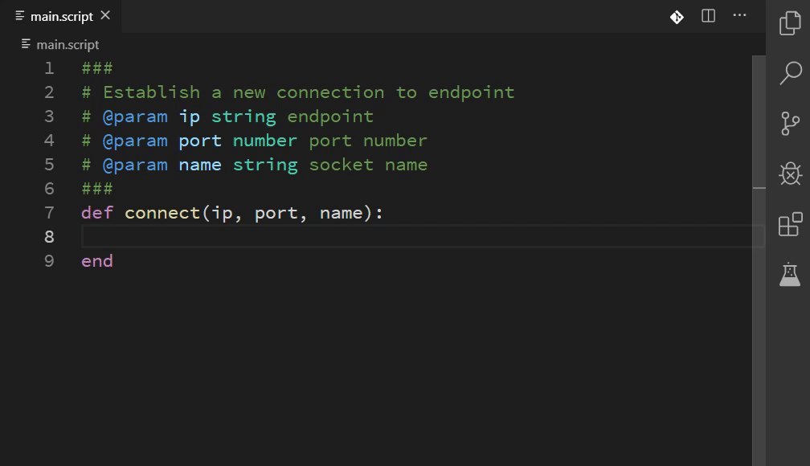
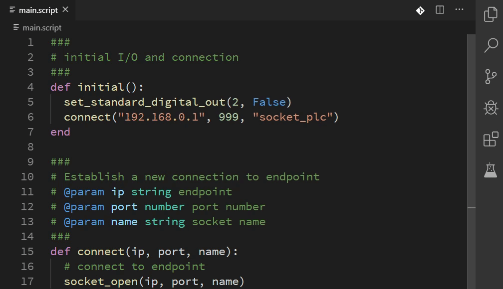
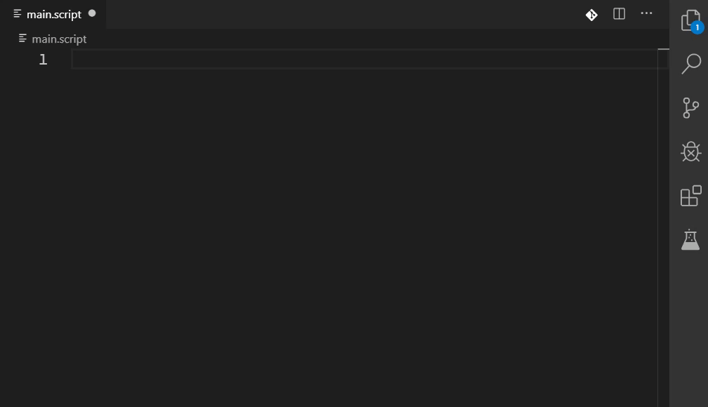
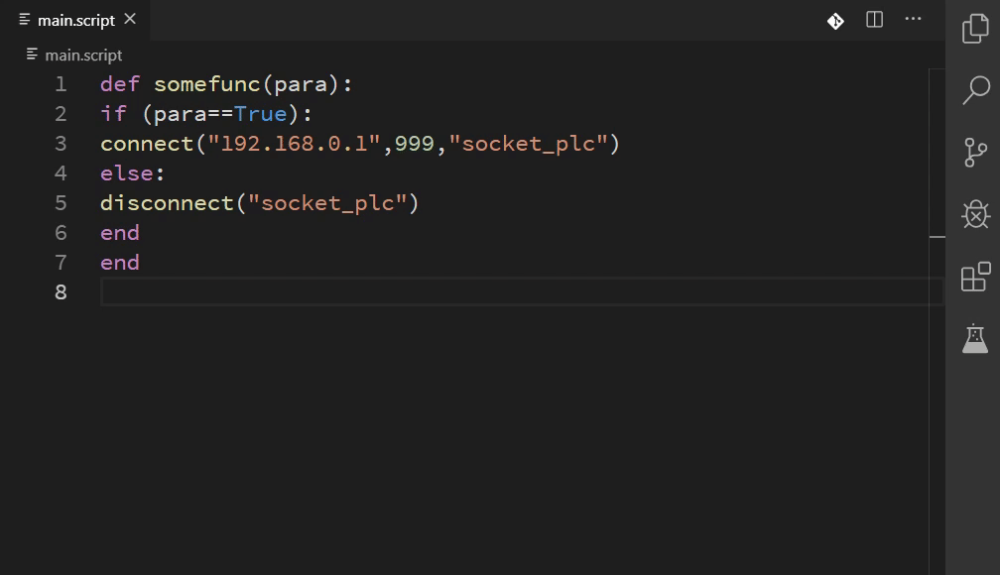

## urscript-extension

[English](README.md)

此專案是為了 [Universal Robots](https://www.universal-robots.com/)™ Script 語言所建的 Visual Studio Code 套件

因 UR 官方僅有 Ubuntu 虛擬機之離線編譯環境，並未提供 Windows 的離線編譯工具，故建立此 VSCode 套件來提供額外的程式撰寫環境，可以更簡單的於任何作業系統下編寫程式

## 提醒

- 此套件 **不包含** 編譯、語法檢查，程式撰寫完畢後仍需傳入控制器或虛擬機進行檢查！
- 此套件 **不包含** 語言伺服器協議(Language Server Protocol, LSP)
- 於啟用 URScript 語言後，會自動更改以下的 VSCode 編輯器參數
  - `editor.tabSize: 2`
  - `editor.insertSpaces: true`
  - `files.eol: '\n'`

## 功能說明

- 自動完成項目與方法簽章
  - 以官方 scriptManual.pdf 所產生對應的方法說明
    

- 滑鼠停留時的方法提示
  - 提供 URScript 方法的提示，若帶有 Doc 註解的自訂方法、變數也會一併顯示
    

- 程式碼區塊
  - 提供如 def、if、while 等語法可以快速建立
    

- 程式碼排版
  - 縮排、增加空白
    

## 版本紀錄

如欲觀看詳細的變更內容，請參考 [change logs](CHANGELOG.md)

### 0.1.x (beta)

- 大致功能已完成，追蹤並修復問題

### 0.0.x (dev)

- CompletionItems、SignatureHelp、Hover、Snippets

## 安裝方式

請於 [releases](https://github.com/ahernguo/urscript-extension/releases) 頁面下載最新的 .vsix 檔案，並安裝至 VSCode.

若想嘗試最新版的功能，須將此專案編譯為 VSIX 後載入。請於命令提示字元執行以下步驟：

1.  `npm install -g vsce` 安裝 Visual Studio Code Extension Manager 至本機電腦
2.  `git clone https://github.com/ahernguo/urscript-extension` 來將本套件下載至本機電腦
3.  `cd urscript-extension` 切換當前目錄至下載的資料夾中
4.  `npm install` 透過 Node.js 來安裝本套件所需的工具
5.  `vsce package` 編譯本套件，將會產生 vsix 套件檔
6.  開啟 VSCode 並於套件中心載入此 vsix 檔案